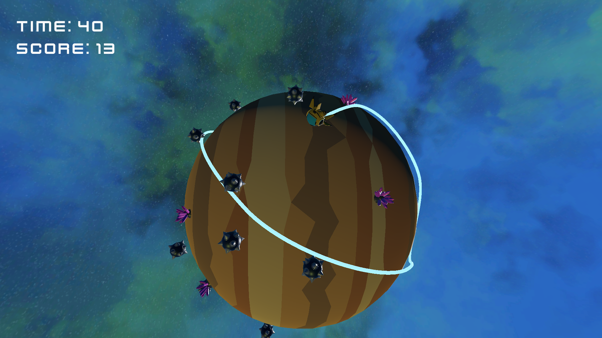

# ORBIT

My entry for https://itch.io/jam/gmtk-2025

You can play this game right now at https://gonkalbell.itch.io/gmtk2025

It's also hosted on github pages: https://gonkalbell.github.io/GMTK2025/

## How to Play

- Move with arrow keys, WASD, or clicking in the direction you want to move
- Loop around crystals with your trail to get points and more time. The more you circle at once, the more points you get
- Don't loop around mines
- Get as many points as you can before you run out of time!

## Credits

- Skybox generated using https://github.com/wwwtyro/space-3d
- Models: https://poly.pizza/u/Quaternius
- UI: https://www.kenney.nl/
- Title Music: https://opengameart.org/content/another-space-background-track
- Game Music: https://opengameart.org/content/tower-defense-theme
